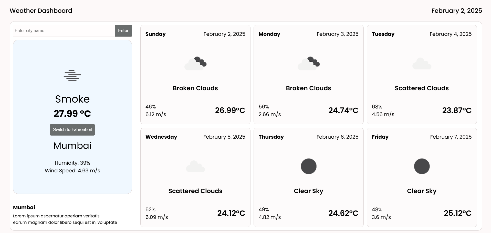
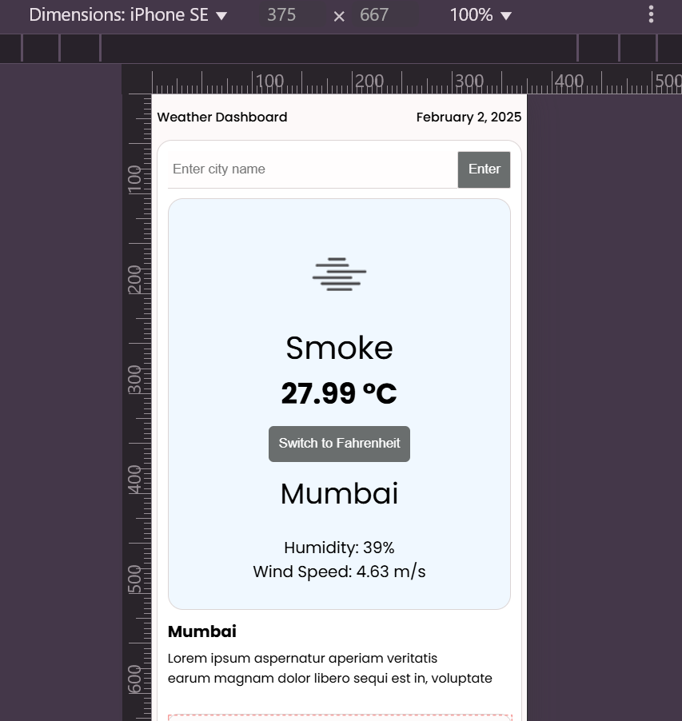

# Weather Dashboard

A React.js based Weather Dashboard that fetches real-time weather data from OpenWeatherMap API. The application demonstrates key React concepts such as functional components, hooks, API integration, state management using React Context, error handling, and polling.

## Features

- **City Search**: Search for a city to display current weather details.
- **Weather Information**: Shows temperature, humidity, wind speed, and weather description.
- **Weather Icon**: Displays an appropriate weather icon based on the fetched data.
- **API Polling**: The weather data is updated every 30 seconds using polling.
- **Unit Switching**: Toggle between Celsius and Fahrenheit for temperature readings.
- **Error Handling**: Graceful error handling for invalid city names or network issues.
- **Local Storage**: Remembers the last searched city and loads its weather data when revisiting the app.
- **5-Day Forecast**: Displays the 5-day weather forecast for the selected city.

## Tech Stack

- **Frontend**: React.js, React Hooks (useState, useEffect, useContext), React Query, React Context API
- **Styling**: CSS Modules
- **API**: OpenWeatherMap API for weather data

## Setup

### 1. Clone the repository

```bash
git clone <repository-url>
```

### 2. Install dependencies

```bash
npm install
```

### 3. Setup environment variables

```.env
VITE_WEATHER_API_KEY = your_api_key
```

### 4. Run the app

```bash
npm run dev
```

The app will be running at `http://localhost:5173`.

## How It Works

- **Search Input**: Users can search for a city, which triggers the fetching of weather data from the API.
- **React Query**: The app uses React Query for managing API calls, caching, and automatic re-fetching of data every 30 seconds.
- **Weather Display**: Displays current weather, wind speed, humidity, and weather description, including an icon based on the conditions.
- **Error Handling**: If the API call fails (e.g., incorrect city name or network issues), an error message is shown to the user.
- **Context API**: The React Context API is used to manage the global state of the weather data
- **User-Friendly & Responsive**: The app is designed to be intuitive and responsive, ensuring a smooth user experience across different devices.

## Features

### Unit Toggle

Switch between Celsius and Fahrenheit using a button. The temperature will update based on the selected unit.

### Local Storage

The last searched city is saved to local storage, and the weather data is automatically loaded when revisiting the app.

### Polling

The weather data automatically refreshes every 30 seconds to show the latest weather conditions.

## Screenshot




## Live Link

You can try out the live version of the app here: https://react-weather-dashboard-one.vercel.app/
